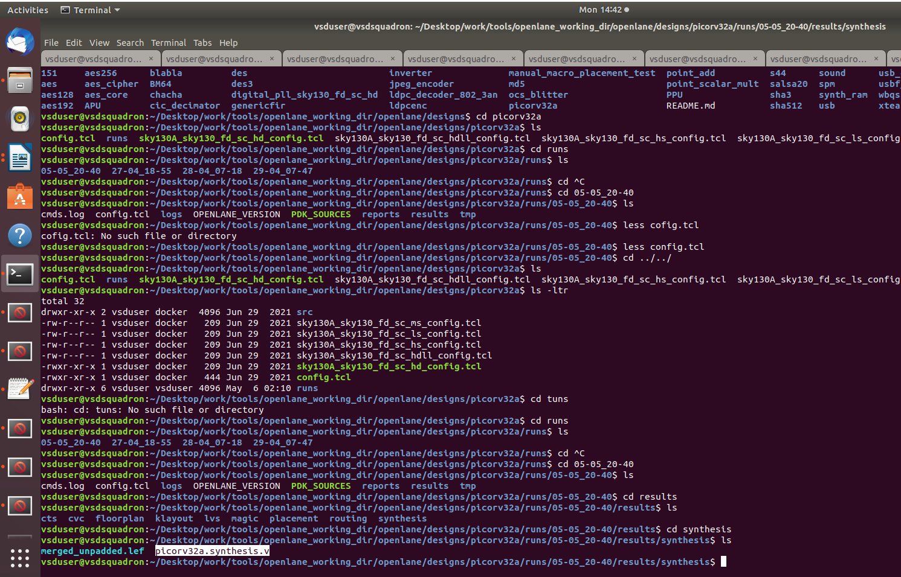
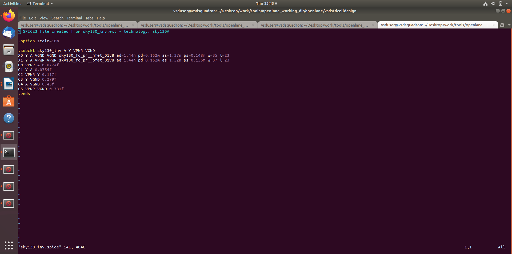
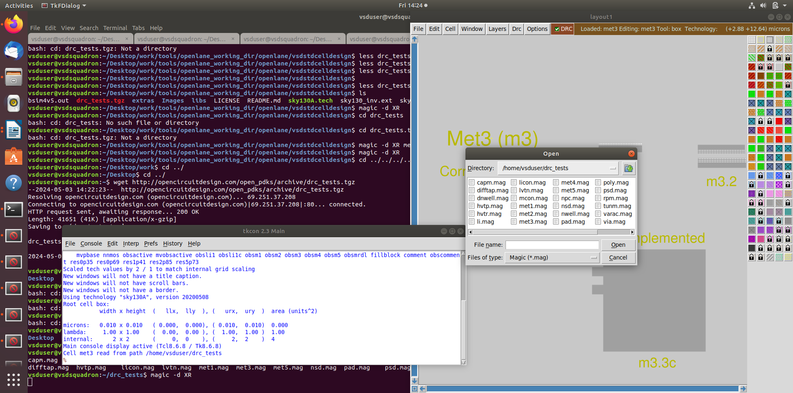
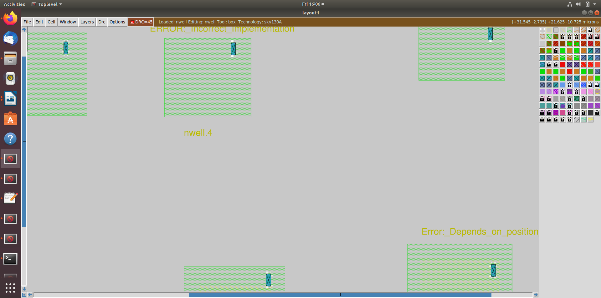

# Digital-VLSI-Soc-Design-and-Planning

This Repo will Cover the Entire Action Items of the Digital VLSI Soc Design and Planning As Part of the **"NASSCOM-VSD SoC Design Program"** 


 ## CONTENTS
 - [DAY-1: Inception of Open-source EDA, OpenLANE and Sky130 PDK](https://github.com/sohail9972/Digital-VLSI-Soc-Design-and-Planning)
 - [DAY-2: Floor Planning and Introduction to Library Cells](https://github.com/sohail9972/Digital-VLSI-Soc-Design-and-Planning)
 - [DAY-3: Design library cell using Magic Layout and ngSpice Characterization](https://github.com/sohail9972/Digital-VLSI-Soc-Design-and-Planning)
 - [DAY-4: Pre-Layout timming analysis and importance of good clock tree](https://github.com/sohail9972/Digital-VLSI-Soc-Design-and-Planning)
 - [DAY-5: Final steps for RTL2GDS using tritonRoute and OpenSTA](https://github.com/sohail9972/Digital-VLSI-Soc-Design-and-Planning) 
 


1.   DAY-1: Inception of Open-source EDA, OpenLANE and Sky130 PDK
       - Chapter 1: Talking to Computers
         - Introduction to QFN-48
         - Introduction to RISC-V
         - Software application and Hardware
       
       - Chapter 2: Soc design and OpenLane
         - Introduction to components of Open Source ASIC design
         - Simplified RTL2GDS flow
         - Introduction to OpenLANE and strive chipsets
         - Detailed ASIC Flow
     
       - Chapter 3: Open-Source EDA Tools
         - OpenLANE Directory structure
         - Design Prepartion Step
         - File Review post design prep and run synthesis
         - OpenLANE Project Git Links
         - Characterize synthesis results
 
 2.  DAY-2: Floor Planning and Introduction to Library Cells
       - Chapter 1: Chip Floor Planning Considerations
         - Utlization Factor and Aspect Ratio 
         - Concept of Pre-placed Cells
         - De-coupling Capacitors
         - Power Planning
         - Pin Placement and Logical Cell Placement blockage
         - Steps to run floorplan using OpneLANE
         - Review floorplan files and steps to view floorplan
         - Review floorplan layout in Magic
       
       - Chapter 2: Library Binding and Placement
         - Netlist binding and initial place design
         - Optimized Placement using estimated wire-length and Capacitance
         - Final placement Optimization
         - Need for libraries and Characterization
         - Congestion awre placement using RePlAce
     
       - Chapter 3: Cell design and Characteriztion Flows
         - Input for cell design flow
         - Circuit design step
         - Layout design step
         - Typical Charcterization Flow
       
       - Chapter 4: General timing Characterization paramets
         - Timming threshold definitions
         - Propagation delay and transition time


3.  DAY-3: Design library cell using Magic Layout and ngspice Characterization
       - Chapter 1: CMOS Inverter ngspice simulations
         - IO Placer revision
         - SPICE deck creation for CMOS Inverter
         - SPICE simulation lab for CMOS Inverter
         - Switching Threshold Vm
         - Static and Dynamic simulation of CMOS Inverter
         - Lab Steps to git clone vsdstdcelldesign
       
       - Chapter 2: Inception of Layout and CMOS fabrication process
         - Create Active regions
         - Formation of N-well and P-well
         - Formation of Gate Terminal
         - Lightly doped Drain formation
         - Source Drain Formation
         - Local interconnect Formation
         - High Level Metal Formation
         - SKy130 basic layers layout and LEFusing Inverter
         - Lab steps to create std cell layout andextract spice netlist
     
       - Chapter 3: Sky130 Tech file
         - Final SPICE deck using Sky130 tech
         - Characterization Inverter using Sky130 model files
         - Lab introduction to Magic tool options and DRC rules
         - Lab introduction to sky130 pdk's and download labs
         - Lab introduction to Magic and steps to load Sky130tech-rules
         - Fixing Poly.9 error in Sky130 techfile
         - Implement poly resistor spacing to diff and tap
         - Lab Challenge exercise to describe DRC error as geometrical construct
         - Lab Challenge to find missing or incorrect rules and fix them


4.   DAY-4: Pre-layout timing analysis and importance of good clock tree
       - Chapter 1: Timing modeling using delay tables
         - Lab steps to convert grid info to track info
         - Lab steps to convert magic layout to std cell LEF
         - Introduction to timming libs and steps to std cel LEF
         - Introduction to timming libs and steps to include new cell in synthesis
         - Introduction to delay tables
         - Delay table usage Part 1
         - Delay table usage Part 2
         - Lab steps to configure synthesis setttings to fix slack and include vsdinv
       
       - Chapter 2: Timing analysis with ideal clocks using openSTA
         - Setup timing analysis and introduction to Filp flop setup time
         - Introdution to clock jitter and Uncertainity
         - Lab steps to Configure OpenSTA for Post -synth timing Analysis
         - Lab steps to optimize synthesis to reduce setup Violations
         - Lab steps to do basic timing ECO
        
     
       - Chapter 3: Clock tree synthesis TritonCTS and signal integrity
         - Clock Tree routing and buffering using H-Tree algorithm
         - Crosstalk and clock net shielding
         - Lab steps to run CTS using TritonCTS
         - Lab steps to verify CTS runs
       
       - Chapter 4: Timing analysis with real clocks using openSTA
         - Setup timing Analysis using real clocks
         - Hold timing analysis using real clocks
         - lab steps to analyze timing with real clocks using openSTA
         - Executing openSTA with right timing libraries 
         - Lab steps to Observe impact of bigger CTS buffers on setup and hold timing


5.   DAY-5: Final Steps for RTL2GDS using tritonRoute and openSTA
       - Chapter 1: Routing and design rule chekc(DRC)
         - Introduction to Maze Routing Algorithm
         - Lee Algorithm Conclusion
         - Design Rule Check
       
       - Chapter 2: Power Distribution Network and routing
         - Build Poer Distribution Network
         - Power straps to std cell power
         - Global and detail Routing and Configuration Triton Route
         
     
       - Chapter 3: TritonRoute Features
         - Triton F1 - Honors Pre-processed route gides
         - Triton F2 and 3 - Inter - guide connectivity and Infra -& inter LAyer routing
         - SKY_L3 - TritonRoute Method to Handle Connectivity
         - SKY_L4 - Routing Topology Algorithm and final list post-route
        


# Chapter 1: Talking to Computers
## Introduction :

 QFN-48 means Quad Flat No-leads which have 48 pins and surface_mount.
  
  Applications : 
  1. Medical Devices
  2. Networking Equipment
  3. Aerospace and Defense
  4. Automative Equipment

## Pin Configuration of QFN-48:
 
# Connections with Main Chip:
 

## Foundary IPs and RISC-V Soc View: 
 

## RISC-V set Architecture :
The RISC-V ISA is designed to support various application domains, from embedded systems to high-performance computing. It offering simplicity, efficiency, and flexibility for applications with stringent resource constraints.


# Chapter 2: Soc design and OpenLane

## Components of Open Sources
PDK : 
 Process Design Kit. It's a collection of files used by semiconductor foundries and integrated circuit (IC) designers to develop and verify semiconductor manufacturing processes and design custom ICs.  the PDK is a critical component of the IC design ecosystem, enabling designers to create custom ICs that meet performance, power, and area requirements while adhering to the constraints of the manufacturing process provided by the foundry.

 - ### OpenSource Digital ASIC Design Flow: 
     

 - ### EDS Tools :
     


## RTL2GDS flow :
 

## OpenLANE and strive chipsets :
 
## strive Soc Family :
 

## OpenLANE ASIC Flow : 
 

- ### Antenna Rule Violation :
   
- ### Solution :
  
- ### Preventive Approach : 
  


# Chapter 3: Open-Source EDA Tools
## Directory Structure : 


## Working with OpenLANE :

> [!TIP]
> Ensure Your in Following Directory - Desktop/work/tools/openlane_working_dir/openlane

```console
- docker
- ./flow.tcl -interactive
- package require openlane 0.9
- prep -design picorv32a
- run_synthesis
- run_floorplan
- run_placement
- run_cts
- run_routing
- run_magic
- run_magic_spice_expert
- run_magic_drc
- run_magic_netgen
- run_magic_antenna_check
```


$
Number  of Flops = No. D filpflops/ No. of Cells
$
$$
Flops = 1613/14876 =0.1084
$$


# Floor Planning and Introduction to Library Cells :

## floor.tcl
```console

Floorplan defaults
set ::env(FP_IO_VMETAL) 3
set ::env(FP_IO_HMETAL) 4

set ::env(FP_SIZING) relative
set ::env(FP_CORE_UTIL) 50
set ::env(FP_CORE_MARGIN) 0
set ::env(FP_ASPECT_RATIO) 1

set ::env(FP_PDN_VOFFSET) 16.32
set ::env(FP_PDN_VPITCH) 153.6
set ::env(FP_PDN_HOFFSET) 16.65
set ::env(FP_PDN_HPITCH) 153.18

set ::env(FP_PDN_AUTO_ADJUST) 1

set ::env(FP_PDN_CORE_RING) 0
set ::env(FP_PDN_ENABLE_RAILS) 1

set ::env(FP_PDN_CHECK_NODES) 1

set ::env(FP_IO_MODE) 1; # 0 matching mode - 1 random equidistant mode
set ::env(FP_IO_HLENGTH) 4
set ::env(FP_IO_VLENGTH) 4
set ::env(FP_IO_VEXTEND) -1
set ::env(FP_IO_HEXTEND) -1
set ::env(FP_IO_VTHICKNESS_MULT) 2
set ::env(FP_IO_HTHICKNESS_MULT) 2

set ::env(BOTTOM_MARGIN_MULT) 4
set ::env(TOP_MARGIN_MULT) 4
```


```console
-run_synthesis
```
 

```console
-run_floorplan
```
> [!CAUTION]
> - Press 'Isert' button to make it Editable form or
> - While in command mode press 'i' to enter edit mode and then type the code which is given below.
> - After editing is done press 'Esc' to once again enter command mode.
> - Now type ':wq' and press enter to save and exit from file.

 
 


### The Main Directory are concerned are runs, config.tcl and syk130A_sky130_fd_sc_hd_config.tcl
## README.md
 
## Structure of Main Directory
 
## Config.tcl


## To see the actual layout after the flow, we have to open the magic file by adding the command 
```
console
magic -T /home/vsduser/Desktop/work/tools/openlane_working_dir/pdks/sky130A/libs.tech/magic/sky130A.tech lef read ../../tmp/merged.lef def read picorv32a.floorplan.def &
```
It opens the Magic tool Now to centeralize the Circuit by clicking S and V
 

  

# To run the Placement, the command
```console
run_placement
```


## The Magic file to see actual view of standerd cells placement.And the actual view in the magic file is given below.
### Commands to load placement def in magic
```console
magic -T /home/vsduser/Desktop/work/tools/openlane_working_dir/pdks/sky130A/libs.tech/magic/sky130A.tech lef read ../../tmp/merged.lef def read picorv32a.placement.def &
```

The placement is done in two stages, Global and detailed. In global placement, legalization is not happened but after detailed placement legalization will be done.
When we run the placement, first Global placement is happens. main objective of glibal placement is to reducing the length of wires.
 
 
 
 
 
 
 
 


# Design library cell using Magic Layout

To get the clone, copy the clone address from reporetery and paste in openlane terminal after the command git clone. this will create the folder called "vsdstdcelldesign" in openlane directory.

```console
git clone https://github.com/nickson-jose/vsdstdcelldesign.git
```
Open another Terminal and Redirect yourself to following Location 
```console
/home/vsduser/Desktop/work/tools/openlane_working_dir/pdks/sky130A/libs.tech/magic
```

Now copy the Sky130A.tech file from this location to cloned location
to open the Inverter circuit in Magic Tool
 

The Metals and There Dimensions

 
 
 
### Both NMOS and PMOs get connected in the "Y" Struture 
 


## Lab steps to create std cell layout and extract spice netlist

Let's do extract with Already Opened tckon window with following Commands 
```console
- extract all
- ext2spice cthresh 0 rthresh 0
- ext2spice
```


Now, let's see what inside the spice file by "vim sky130_inv.spice". which is been Created Recently


 
 


#Updating the file 
```console
* SPICE3 file created from sky130_inv.ext - technology: sky130A

.option scale=0.01u
.include ./libs/pshort.lib
.include ./libs/nshort.lib


//.subckt sky130_inv A Y VPWR VGND
X0 Y A VGND VGND sky130_fd_pr__nfet_01v8 ad=1.44n pd=0.152m as=1.37n ps=0.148m w=35 l=23
X1 Y A VPWR VPWR sky130_fd_pr__pfet_01v8 ad=1.44n pd=0.152m as=1.52n ps=0.156m w=37 l=23
C0 VPWR A 0.0774f
C1 Y A 0.0754f
C2 VPWR Y 0.117f
C3 Y VGND 0.279f
C4 A VGND 0.45f
//C5 VPWR VGND 0.781f
//.ends
.tran 1n 20n
.control run
.endc
.end
```


after running this file we get output of ngspice like this,
 

To plot the graph between Voltage and time type the command in ngspice
```console
'plot y vs time a'
```

 
 ### Rise time,Fall time Propagtion Delay and Cell Fall Delay
 


# DRC Corrections and rules

To Proceed with the DRC Corrections and Rules , First Download the Folloing Lab files

```console
   wget http://opencircuitdesign.com/open_pdks/archive/drc_tests.tgz
```
Extracft the Files
```console
tar xfz drc_tests.tgz 
```
To initiate the Magic tool Enter the Command 
```console
  magic -d XR
```

Using Magic Tool , Open the met3.mag file from Menu
 
 
 

 
 
 

## Dimensions : 
 
 
### Next, select a blank area and hover the mouse pointer over the metal3 contact icon. Press the p button and type 'peek' in the tkcon. Then execute the command cif see VIA2 in the tkcon tab.
### we will see a bunch of black squares appear inside the area.
 
 


# Fixing ploy.9 error
```console
load poly.mag
```


 
 
As the Dimension of the Metal is Not as Expected 
 
### Solution :
 
 
 
 
 
 
 

# Lab challenge exercise to describe DRC error as geometrical construct
 
 
 
 
 
 
 


### Solution :

